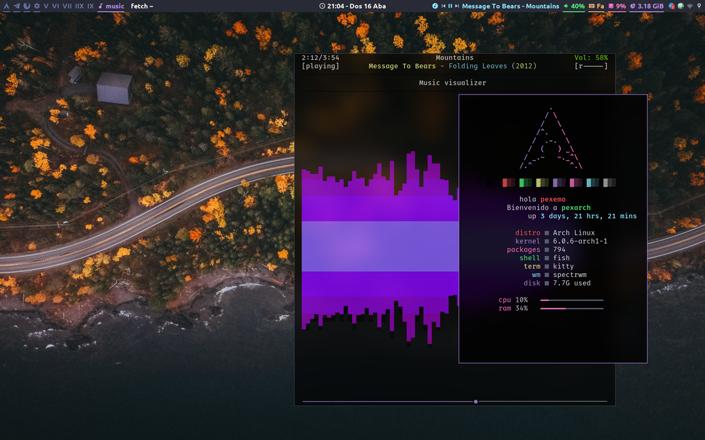

<h1 align="center">Dotfiles of <a href="https://github.com/pexemo">pexemo</a>!</h1>

My Linux distribution configuration files

## For spectrwm:

# Used Apps
- [Rofi](https://github.com/davatorium/rofi) Application launcher and menus
- [ranger](https://github.com/ranger/ranger) TUI file manager based on Vim
- [ncmpcpp](https://github.com/ncmpcpp/ncmpcpp) Music player with [MPD](https://github.com/MusicPlayerDaemon/MPD) (controled by [mpc](https://musicpd.org/doc/mpc/html/) on rofi)
- [kitty](https://github.com/kovidgoyal/kitty) Terminal emulator
- [polybar](https://github.com/polybar/polybar) used in spectrwm
- [picom](https://github.com/jonaburg/picom) jonaburg fork of picom compositor
- [nitrogen](https://github.com/l3ib/nitrogen) background changer
- [lxpolkit](https://github.com/lxde/lxsession) for authentications
